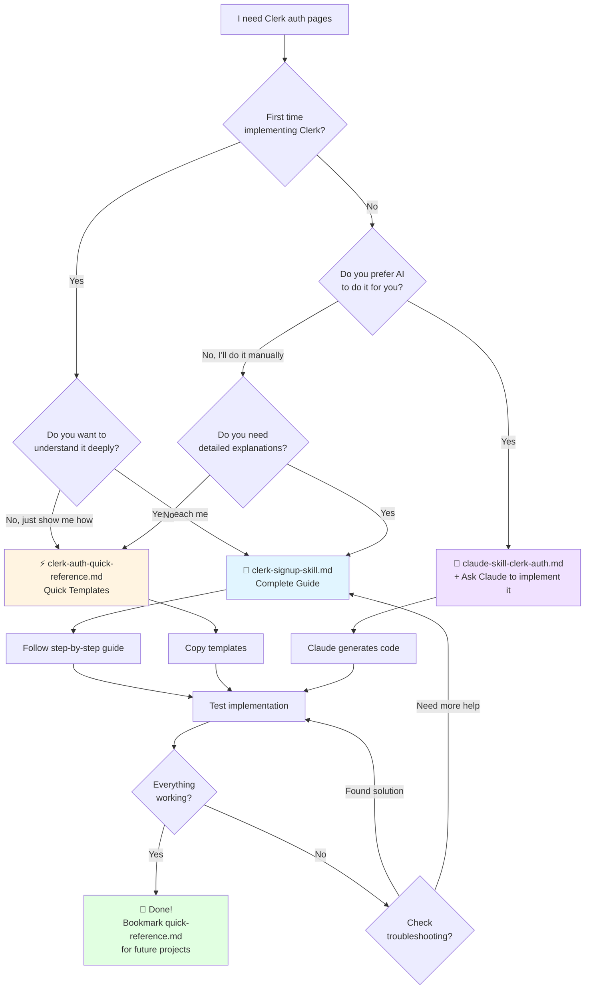
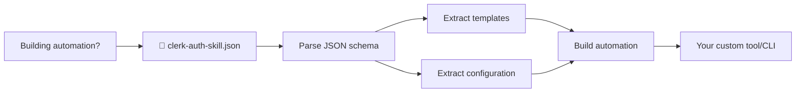
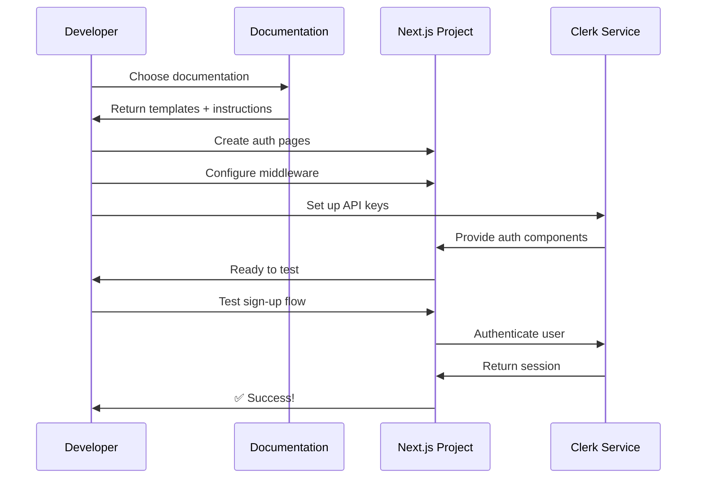
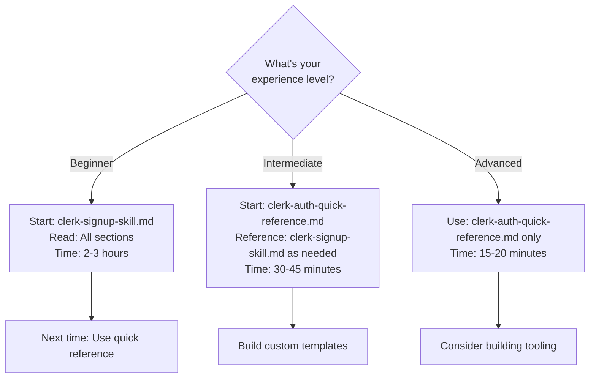
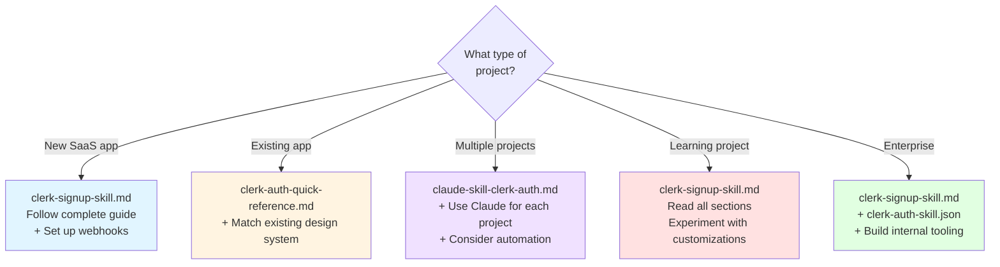
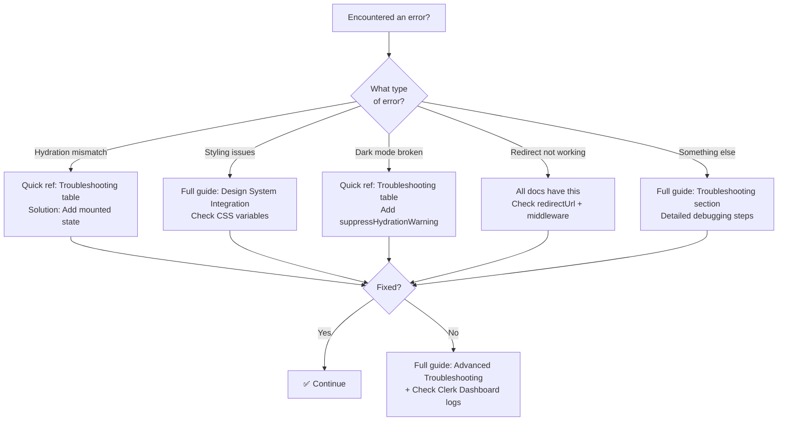
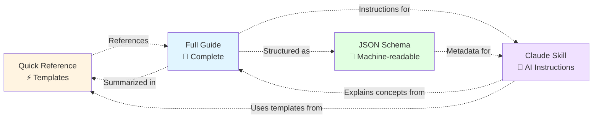
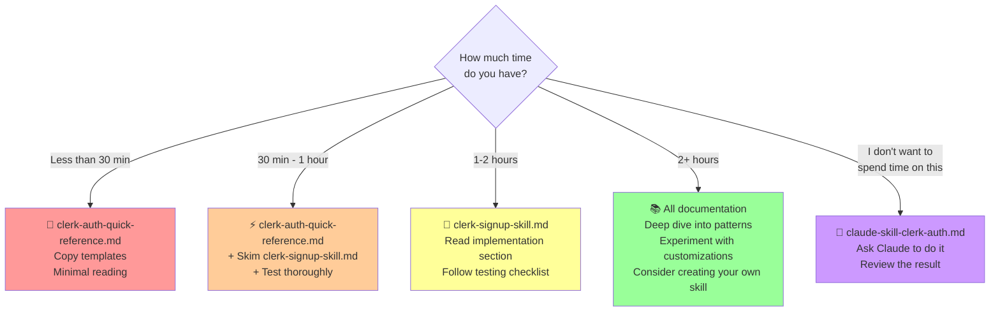

# Clerk Auth Skill - Decision Flowchart

## Which Documentation Should I Use?



## For Tool Builders



## Implementation Flow



## Experience Level Guide



## Project Type Guide



## Troubleshooting Decision Tree



## Documentation Relationships



## Time-Based Selection



## Quick Decision Table

| If you... | Use this | Because |
|-----------|----------|---------|
| Are new to Clerk | 📘 clerk-signup-skill.md | Complete learning path |
| Need code fast | ⚡ clerk-auth-quick-reference.md | Ready templates |
| Want AI to do it | 🤖 claude-skill-clerk-auth.md | AI instructions |
| Are building tools | 📄 clerk-auth-skill.json | Machine-readable |
| Have < 30 minutes | ⚡ clerk-auth-quick-reference.md | Fastest option |
| Want to understand deeply | 📘 clerk-signup-skill.md | Most comprehensive |
| Hit an error | Any doc's troubleshooting | All have solutions |
| Multiple projects | 🤖 + 📄 | Automation friendly |

## Summary

### 🎯 Most Common Path
```
First time:     clerk-signup-skill.md (full guide)
                      ↓
After learning: clerk-auth-quick-reference.md (quick templates)
                      ↓
Future:         Bookmark quick reference for 15-minute implementations
```

### 🤖 AI-Assisted Path
```
Any time:       Give claude-skill-clerk-auth.md to Claude
                      ↓
                Ask: "Implement this skill"
                      ↓
                Review + test the generated code
```

### 🛠️ Tool Builder Path
```
Planning:       Read clerk-signup-skill.md (understand patterns)
                      ↓
Building:       Parse clerk-auth-skill.json (structured data)
                      ↓
Testing:        Validate against clerk-auth-quick-reference.md
```

---

**Still not sure?** Start with **README-CLERK-SKILL.md** - it explains all options!
