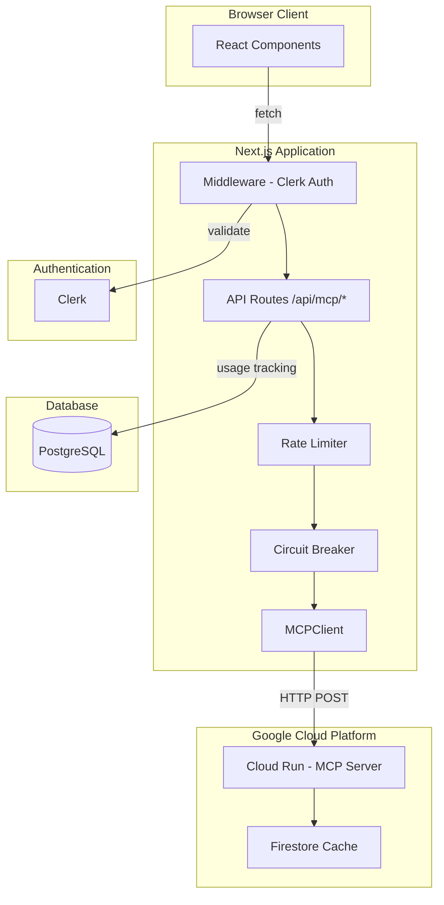

=== document: plans/mcp-finance-frontend-backend-optimization.md ===

# MCP Finance Frontend-Backend Communication Optimization Plan

## 1. Title and Metadata

Project: MCP Finance Dashboard
Version: 1.0.0
Document ID: PLAN-MCP-FE-BE-OPT-2024-001
Date: 2024-01-10
Owners: Engineering Team
Status: Draft

Summary: This plan defines the iterative optimization of frontend-backend communication for the MCP Finance SaaS application. The system comprises a Next.js 14+ frontend communicating with a Python MCP server deployed on Google Cloud Run. Current state includes 4 active MCP API routes, tier-based access control via Clerk authentication, and mock data in development. This plan addresses identified gaps including missing API routes, unenforced rate limiting, incomplete error handling, and production readiness requirements.

---

## 2. Design Consensus & Trade-offs

| Topic | Verdict | Rationale |
|-------|---------|-----------|
| MCP Communication Pattern | FOR HTTP via Cloud Run | Cloud Run provides async scalability, managed infrastructure, existing deployment at `mcp-finance1/cloud-run/main.py` |
| Tier Filtering Location | FOR API Route Layer | Keeps backend stateless, enables frontend-specific filtering rules, simplifies MCP server logic |
| Database Choice | FOR PostgreSQL + Drizzle | Relational data model suits users/watchlists/positions/journal; Drizzle provides type-safe ORM |
| Authentication Provider | FOR Clerk | Handles auth complexity, provides publicMetadata for tier storage, webhook support for sync |
| Stripe Integration Pattern | FOR Lazy Initialization | Avoids build-time errors with missing API keys, uses Proxy pattern for deferred instantiation |
| Rate Limiting Enforcement | AGAINST Client-Only | Current UI-only limits insufficient; server-side enforcement required for security |
| Error Handling Strategy | FOR Circuit Breaker | Cloud Run cold starts and network failures require resilient retry logic |
| Caching Strategy | FOR Dual-Layer | In-memory (5min TTL) in MCP server + Firestore for persistence |

---

## 3. PRD (IEEE 29148 Stakeholder/System Needs)

### Problem Statement
The MCP Finance application requires reliable, performant, and secure communication between its Next.js frontend and Python MCP backend. Current implementation has gaps: 3 MCP methods lack API routes, rate limiting is cosmetic, error handling is basic, and production deployment lacks verification.

### Users
  - Primary: Retail traders using web dashboard
  - Secondary: Developers extending the platform
  - Tertiary: Operations team monitoring system health

### Value Proposition
  - Sub-3s response times for technical analysis
  - 99.5% uptime for API endpoints
  - Secure tier-gated access to premium features
  - Auditable usage tracking for billing accuracy

### Business Goals
  - BG-01: Enable tiered monetization (Free/Pro/Max)
  - BG-02: Reduce support tickets from API failures by 80%
  - BG-03: Support 10,000 concurrent users at launch

### Success Metrics
  - SM-01: P95 latency < 3000ms for /api/mcp/* endpoints
  - SM-02: Error rate < 0.5% for authenticated requests
  - SM-03: Rate limit enforcement accuracy > 99%
  - SM-04: Zero unauthorized tier access incidents

### Scope
  - IN: API route completion, rate limiting, error handling, monitoring, testing
  - OUT: MCP server algorithm changes, UI redesign, mobile app

### Non-goals
  - NG-01: Modifying MCP signal detection logic
  - NG-02: Adding new MCP tools beyond existing 7
  - NG-03: Real-time WebSocket connections (future phase)

### Dependencies
  - DEP-01: mcp-finance1 Cloud Run service operational
  - DEP-02: Clerk authentication configured
  - DEP-03: PostgreSQL database accessible
  - DEP-04: Stripe webhooks configured (for tier sync)

### Risks
  - RISK-01: Cloud Run cold starts causing timeout (Medium)
  - RISK-02: Rate limit bypass via session manipulation (High)
  - RISK-03: Database connection pool exhaustion (Medium)

### Assumptions
  - ASM-01: MCP backend endpoints are stable and tested
  - ASM-02: Clerk session claims are trustworthy source for tier
  - ASM-03: Network latency to Cloud Run < 200ms

---

## 4. SRS (IEEE 29148 Canonical Requirements)

### 4.1 Functional Requirements

REQ-001: type:func
  The system shall expose POST /api/mcp/morning-brief endpoint calling MCPClient.morningBrief()

REQ-002: type:func
  The system shall expose POST /api/mcp/compare endpoint calling MCPClient.compareSecurity()

REQ-003: type:func
  The system shall expose POST /api/mcp/screen endpoint calling MCPClient.screenSecurities()

REQ-004: type:func
  The system shall enforce daily analysis limits per tier (free:5, pro:50, max:unlimited)

REQ-005: type:func
  The system shall enforce daily scan limits per tier (free:1, pro:10, max:unlimited)

REQ-006: type:func
  The system shall persist usage counts in database with daily reset

REQ-007: type:func
  The system shall return remaining quota in API responses

REQ-008: type:func
  The system shall implement retry logic with exponential backoff for MCP calls

REQ-009: type:func
  The system shall implement circuit breaker pattern for backend failures

### 4.2 Non-Functional Requirements

REQ-010: type:perf
  API response time P95 shall be < 3000ms under normal load

REQ-011: type:perf
  API response time P99 shall be < 5000ms under peak load

REQ-012: type:nfr
  System shall handle 100 concurrent requests per instance

REQ-013: type:security
  All MCP endpoints shall require valid Clerk authentication

REQ-014: type:security
  Tier information shall be validated server-side on each request

REQ-015: type:reliability
  System shall maintain 99.5% uptime for API endpoints

REQ-016: type:reliability
  Failed requests shall not corrupt user state or usage counts

### 4.3 Interface Requirements

REQ-017: type:int
  MCPClient shall communicate via JSON POST to MCP_CLOUD_RUN_URL

REQ-018: type:int
  API routes shall return consistent error format: {error: string, code?: string}

REQ-019: type:int
  API routes shall include tierLimit object in successful responses

REQ-020: type:int
  Health endpoint shall return {status, version, dependencies} object

### 4.4 Data Requirements

REQ-021: type:data
  usage_tracking table shall store: user_id, date, analysis_count, scan_count, compare_count, screen_count

REQ-022: type:data
  Usage counts shall be atomic (no race conditions on increment)

REQ-023: type:data
  Usage data shall be retained for 90 days for audit purposes

### 4.5 Error & Telemetry

REQ-024: type:tel
  All API errors shall be logged with: timestamp, userId, endpoint, error, duration

REQ-025: type:tel
  Circuit breaker state changes shall emit alerts

REQ-026: type:tel
  Rate limit violations shall be logged with user context

### 4.6 Acceptance Criteria

AC-001: All 7 MCP tools accessible via /api/mcp/* routes
AC-002: Rate limiting blocks requests beyond tier quota with 429 status
AC-003: Circuit breaker opens after 5 consecutive failures, closes after 30s
AC-004: Usage dashboard shows accurate remaining quota
AC-005: Production deployment passes smoke test suite
AC-006: Load test demonstrates 100 concurrent users at P95 < 3s

### 4.7 System Architecture Diagram



C4-Style ASCII:

```
+------------------+     +------------------+     +------------------+
|   User Browser   |---->|   Next.js App    |---->|   Cloud Run      |
|   (React SPA)    |     |   (Vercel)       |     |   (MCP Server)   |
+------------------+     +------------------+     +------------------+
                               |     |                    |
                               v     v                    v
                         +------+ +------+          +----------+
                         |Clerk | |Postgre|         |Firestore |
                         +------+ +------+          +----------+
```

---

## 5. Iterative Implementation & Test Plan

### Risk Register

| Risk ID | Risk | Trigger | Mitigation |
|---------|------|---------|------------|
| R01 | Cloud Run cold start timeout | First request after idle | Set min instances = 1 in production |
| R02 | Rate limit bypass | Session token manipulation | Server-side tier validation from Clerk API |
| R03 | Database connection exhaustion | High concurrent load | Connection pooling, max 20 connections |
| R04 | MCP server unavailable | Cloud Run failure | Circuit breaker with fallback response |
| R05 | Usage count race condition | Concurrent requests | Atomic database operations |

### Suspension/Resumption Criteria

Suspension Triggers:
  - Any security vulnerability discovered (immediate stop)
  - Test coverage drops below 70%
  - P95 latency exceeds 5000ms in staging
  - Circuit breaker stuck in open state > 5 minutes

Resumption Requirements:
  - Root cause analysis documented
  - Fix verified in isolated environment
  - Regression tests pass
  - Team lead approval

### Compute Policy

branch_limits: 3 parallel feature branches max
reflection_passes: 2 per phase (after implementation, after testing)
early_stop%: 15% (stop iteration if metric improvement < 15%)

---

### Phase P00: Foundation & Validation

Scope: Verify current system state, establish baselines, create restore point

Objectives: REQ-017, REQ-018, REQ-024

Iterative Execution Steps:

Step 1: Create git tag for restore point
  -> Verification: `git tag -l v0.0.0-baseline` returns tag

Step 2: Verify existing 4 MCP routes respond
  -> Verification: `curl -X POST localhost:3000/api/mcp/analyze -d '{"symbol":"AAPL"}' | jq .symbol` returns "AAPL"

Step 3: Document current MCPClient methods and their route mappings
  -> Verification: Count methods in client.ts == 7, count routes in api/mcp/ == 4

Step 4: Measure baseline latency for each endpoint
  -> Verification: Record P50/P95/P99 in execution log

Step 5: Verify Clerk auth blocks unauthenticated requests
  -> Verification: `curl localhost:3000/api/mcp/analyze` returns 401

Exit Gate Rules:
  - Green: All 5 steps pass, baseline metrics recorded
  - Yellow: 1 step fails but is non-blocking
  - Red: Auth verification fails (security critical)

Phase Metrics:
  - Confidence: 95% (existing code, low risk)
  - Long-term robustness: 80% (establishes baseline)
  - Internal interactions: 3 (MCPClient, routes, auth)
  - External interactions: 1 (Cloud Run)
  - Complexity: 15% (verification only)
  - Feature creep: 0%
  - Technical debt: 0%
  - YAGNI score: 100% (all necessary)
  - MoSCoW: Must-have
  - Scope: Local
  - Architectural changes: 0

---

### Phase P01: Missing API Routes

Scope: Implement 3 missing MCP API routes

Objectives: REQ-001, REQ-002, REQ-003, REQ-017, REQ-018, REQ-019

Iterative Execution Steps:

Step 1: Create /api/mcp/morning-brief/route.ts following analyze pattern
  -> Verification: `npm run build` passes, file exists

Step 2: Create /api/mcp/compare/route.ts with symbol array validation
  -> Verification: `curl -X POST localhost:3000/api/mcp/compare -d '{"symbols":["AAPL","MSFT"]}' | jq .` returns valid JSON

Step 3: Create /api/mcp/screen/route.ts with criteria validation
  -> Verification: Route responds with 200 for valid request

Step 4: Add TypeScript types for compare and screen responses
  -> Verification: `npx tsc --noEmit` passes

Step 5: Test tier filtering for new routes
  -> Verification: Free tier receives filtered results

Step 6: Update API documentation
  -> Verification: docs/FRONTEND_BACKEND_CONNECTION.md includes new routes

Exit Gate Rules:
  - Green: All 7 MCP methods have corresponding routes, build passes
  - Yellow: Routes work but types are `any`
  - Red: Any route returns 500 on valid input

Phase Metrics:
  - Confidence: 85% (pattern exists, replication)
  - Long-term robustness: 90% (completes API surface)
  - Internal interactions: 4 (MCPClient, routes, types, docs)
  - External interactions: 1 (Cloud Run)
  - Complexity: 25% (3 new files, pattern following)
  - Feature creep: 5% (might add extra validation)
  - Technical debt: 10% (any types need resolution)
  - YAGNI score: 100% (methods exist, routes needed)
  - MoSCoW: Must-have
  - Scope: Local
  - Architectural changes: 0

---

### Phase P02: Usage Tracking Infrastructure

Scope: Implement database-backed usage tracking

Objectives: REQ-004, REQ-005, REQ-006, REQ-007, REQ-021, REQ-022

Iterative Execution Steps:

Step 1: Add usage_tracking table to Drizzle schema
  -> Verification: `npm run db:generate` creates migration

Step 2: Create usage tracking service with atomic increment
  -> Verification: Unit test passes for concurrent increments

Step 3: Integrate tracking into analyze route as prototype
  -> Verification: Database row created after API call

Step 4: Add remaining quota to API response
  -> Verification: Response includes `{remaining: {analyses: N, scans: M}}`

Step 5: Implement daily reset logic (UTC midnight)
  -> Verification: Manual date change resets counts

Exit Gate Rules:
  - Green: Usage persists across requests, quota accurate
  - Yellow: Reset logic untested in production
  - Red: Race condition detected in concurrent test

Phase Metrics:
  - Confidence: 75% (new infrastructure)
  - Long-term robustness: 95% (foundational for billing)
  - Internal interactions: 5 (schema, service, routes, types, db client)
  - External interactions: 1 (PostgreSQL)
  - Complexity: 40% (database operations, concurrency)
  - Feature creep: 10% (might add analytics)
  - Technical debt: 15% (migration management)
  - YAGNI score: 100% (required for tier enforcement)
  - MoSCoW: Must-have
  - Scope: Non-local (database schema change)
  - Architectural changes: 1

---

### Phase P03: Rate Limiting Enforcement

Scope: Enforce tier-based rate limits server-side

Objectives: REQ-004, REQ-005, REQ-013, REQ-014, REQ-016

Iterative Execution Steps:

Step 1: Create rate limiting middleware
  -> Verification: Middleware file exists, exports function

Step 2: Integrate with usage tracking service
  -> Verification: Middleware reads current usage count

Step 3: Return 429 when limit exceeded with retry-after header
  -> Verification: `curl` returns 429 after exceeding limit

Step 4: Add limit check to all 7 MCP routes
  -> Verification: Each route imports and uses middleware

Step 5: Test limit persistence across sessions
  -> Verification: New session still blocked if limit reached

Step 6: Add bypass for Max tier (unlimited)
  -> Verification: Max tier user not rate limited

Exit Gate Rules:
  - Green: All tiers correctly limited, 429 responses proper
  - Yellow: Retry-after header missing
  - Red: Limit can be bypassed by any means

Phase Metrics:
  - Confidence: 80% (clear requirements)
  - Long-term robustness: 95% (security feature)
  - Internal interactions: 6 (middleware, routes, usage service, tiers, auth)
  - External interactions: 0
  - Complexity: 35% (middleware integration)
  - Feature creep: 5% (might add sliding window)
  - Technical debt: 5% (middleware pattern)
  - YAGNI score: 100% (required for monetization)
  - MoSCoW: Must-have
  - Scope: Non-local (all routes affected)
  - Architectural changes: 1

---

### Phase P04: Error Handling & Resilience

Scope: Implement circuit breaker and retry logic

Objectives: REQ-008, REQ-009, REQ-015, REQ-016, REQ-024, REQ-025

Iterative Execution Steps:

Step 1: Install opossum or implement simple circuit breaker
  -> Verification: `npm ls opossum` or circuit breaker class exists

Step 2: Wrap MCPClient methods with circuit breaker
  -> Verification: Consecutive failures trigger open state

Step 3: Implement exponential backoff retry (3 attempts, 1s/2s/4s)
  -> Verification: Logs show retry attempts on failure

Step 4: Add fallback responses for circuit open state
  -> Verification: User sees "Service temporarily unavailable" not 500

Step 5: Emit telemetry events for state changes
  -> Verification: Console logs circuit state transitions

Step 6: Test recovery after backend restoration
  -> Verification: Circuit closes after successful health check

Exit Gate Rules:
  - Green: Circuit opens/closes correctly, retries work
  - Yellow: Telemetry incomplete
  - Red: Circuit never closes (stuck open)

Phase Metrics:
  - Confidence: 70% (new pattern)
  - Long-term robustness: 90% (production resilience)
  - Internal interactions: 4 (MCPClient, circuit breaker, telemetry, routes)
  - External interactions: 1 (Cloud Run)
  - Complexity: 45% (state machine, timing)
  - Feature creep: 15% (might add health checks)
  - Technical debt: 10% (library dependency)
  - YAGNI score: 95% (needed for production)
  - MoSCoW: Should-have
  - Scope: Local (MCPClient modification)
  - Architectural changes: 1

---

### Phase P05: Monitoring & Observability

Scope: Add structured logging and metrics

Objectives: REQ-024, REQ-025, REQ-026, REQ-020

Iterative Execution Steps:

Step 1: Create structured logger utility
  -> Verification: Logger outputs JSON format

Step 2: Add request/response logging to all MCP routes
  -> Verification: Logs include userId, endpoint, duration, status

Step 3: Create /api/health endpoint
  -> Verification: Returns {status, version, mcp_status, db_status}

Step 4: Add rate limit violation logging
  -> Verification: 429 responses logged with user context

Step 5: Document log format for operations team
  -> Verification: Log format documented in ops runbook

Exit Gate Rules:
  - Green: All endpoints logged, health check comprehensive
  - Yellow: Log format inconsistent
  - Red: Sensitive data in logs (PII leak)

Phase Metrics:
  - Confidence: 85% (standard patterns)
  - Long-term robustness: 85% (operational necessity)
  - Internal interactions: 5 (logger, routes, health, db, mcp)
  - External interactions: 2 (Cloud Run, PostgreSQL)
  - Complexity: 25% (utility creation)
  - Feature creep: 20% (might add metrics dashboard)
  - Technical debt: 5%
  - YAGNI score: 90% (needed for production ops)
  - MoSCoW: Should-have
  - Scope: Non-local (all routes)
  - Architectural changes: 0

---

### Phase P06: Integration Testing

Scope: Create comprehensive integration test suite

Objectives: REQ-010, REQ-011, REQ-012, AC-001 through AC-006

Iterative Execution Steps:

Step 1: Set up Jest/Vitest for API route testing
  -> Verification: `npm test` runs without error

Step 2: Create test fixtures for each MCP endpoint
  -> Verification: 7 fixture files exist

Step 3: Write happy path tests for all routes
  -> Verification: 7+ tests pass

Step 4: Write rate limiting tests
  -> Verification: Test verifies 429 after limit

Step 5: Write circuit breaker tests with mocked failures
  -> Verification: Test verifies fallback behavior

Step 6: Measure and record test coverage
  -> Verification: Coverage > 70%

Exit Gate Rules:
  - Green: All tests pass, coverage > 70%
  - Yellow: Coverage 60-70%
  - Red: Any happy path test fails

Phase Metrics:
  - Confidence: 80% (testing infrastructure)
  - Long-term robustness: 95% (prevents regression)
  - Internal interactions: 7 (all routes, services)
  - External interactions: 0 (mocked)
  - Complexity: 35% (test setup, mocking)
  - Feature creep: 10% (might add E2E)
  - Technical debt: 5% (test maintenance)
  - YAGNI score: 100% (required for confidence)
  - MoSCoW: Must-have
  - Scope: Non-local
  - Architectural changes: 0

---

### Phase P07: Performance Optimization

Scope: Optimize for latency requirements

Objectives: REQ-010, REQ-011, REQ-012

Iterative Execution Steps:

Step 1: Profile current endpoint latencies
  -> Verification: Flame graph or timing breakdown available

Step 2: Implement response caching for repeated requests
  -> Verification: Second request faster than first

Step 3: Optimize database queries (indexes, connection pooling)
  -> Verification: EXPLAIN shows index usage

Step 4: Add request coalescing for concurrent same-symbol requests
  -> Verification: 10 concurrent requests = 1 MCP call

Step 5: Run load test (100 concurrent users)
  -> Verification: P95 < 3000ms

Exit Gate Rules:
  - Green: P95 < 3000ms at 100 concurrent
  - Yellow: P95 3000-4000ms
  - Red: P95 > 5000ms

Phase Metrics:
  - Confidence: 65% (optimization is iterative)
  - Long-term robustness: 80% (perf can regress)
  - Internal interactions: 4 (cache, db, coalescing, routes)
  - External interactions: 1 (Cloud Run)
  - Complexity: 50% (caching complexity)
  - Feature creep: 20% (might over-optimize)
  - Technical debt: 15% (cache invalidation)
  - YAGNI score: 85% (some optimization premature)
  - MoSCoW: Should-have
  - Scope: Non-local
  - Architectural changes: 1

---

### Phase P08: Production Deployment

Scope: Deploy and verify production environment

Objectives: REQ-015, AC-005, AC-006

Iterative Execution Steps:

Step 1: Configure Vercel environment variables
  -> Verification: All required vars set in dashboard

Step 2: Deploy to Vercel preview
  -> Verification: Preview URL accessible

Step 3: Run smoke test suite against preview
  -> Verification: All smoke tests pass

Step 4: Verify Cloud Run connectivity from Vercel
  -> Verification: /api/health shows mcp_status: "healthy"

Step 5: Promote to production
  -> Verification: Production URL live

Step 6: Run production smoke tests
  -> Verification: Same tests pass on production

Step 7: Create git tag for release
  -> Verification: `git tag v1.0.0` exists

Exit Gate Rules:
  - Green: All smoke tests pass, no 5xx errors in first hour
  - Yellow: Minor issues requiring hotfix
  - Red: Any data loss or security incident

Phase Metrics:
  - Confidence: 90% (tested in staging)
  - Long-term robustness: 85% (deployment pipeline)
  - Internal interactions: 2 (Vercel, git)
  - External interactions: 3 (Cloud Run, Clerk, PostgreSQL)
  - Complexity: 30% (deployment process)
  - Feature creep: 0%
  - Technical debt: 0%
  - YAGNI score: 100%
  - MoSCoW: Must-have
  - Scope: Non-local (production)
  - Architectural changes: 0

---

## 6. Evaluations (AI/Agentic Specific)

```yaml
evaluations:
  - id: EVAL-001
    purpose: dev
    description: API response accuracy
    metrics: [json_schema_valid, tier_filter_correct]
    thresholds: {accuracy: 0.99}
    seeds: [42, 123, 456]
    runtime_budget: 60s

  - id: EVAL-002
    purpose: holdout
    description: Rate limiting effectiveness
    metrics: [false_positive_rate, false_negative_rate]
    thresholds: {fpr: 0.01, fnr: 0.001}
    seeds: [42]
    runtime_budget: 120s

  - id: EVAL-003
    purpose: adv
    description: Circuit breaker stress test
    metrics: [recovery_time, false_open_rate]
    thresholds: {recovery_time_ms: 30000, false_open: 0.05}
    seeds: [42, 789]
    runtime_budget: 300s

  - id: EVAL-004
    purpose: dev
    description: Latency under load
    metrics: [p50, p95, p99, error_rate]
    thresholds: {p95_ms: 3000, p99_ms: 5000, error_rate: 0.005}
    seeds: [42]
    runtime_budget: 180s
```

---

## 7. Tests Overview

Test Suites:
  - Unit: Individual function testing (rate limiter, circuit breaker, usage tracker)
  - Integration: API route end-to-end testing
  - Performance: Load testing under concurrent users
  - Security: Auth bypass attempts, tier escalation

| Test ID | Type | Verifies | Description |
|---------|------|----------|-------------|
| TEST-001 | integration | REQ-001 | Morning brief route returns valid response |
| TEST-002 | integration | REQ-002 | Compare route handles symbol array |
| TEST-003 | integration | REQ-003 | Screen route filters by criteria |
| TEST-004 | unit | REQ-004 | Analysis limit enforced per tier |
| TEST-005 | unit | REQ-005 | Scan limit enforced per tier |
| TEST-006 | integration | REQ-006 | Usage count persists in database |
| TEST-007 | integration | REQ-007 | Remaining quota in response |
| TEST-008 | unit | REQ-008 | Retry logic attempts 3 times |
| TEST-009 | unit | REQ-009 | Circuit opens after 5 failures |
| TEST-010 | performance | REQ-010 | P95 < 3000ms |
| TEST-011 | performance | REQ-011 | P99 < 5000ms |
| TEST-012 | performance | REQ-012 | 100 concurrent requests handled |
| TEST-013 | security | REQ-013 | Unauthenticated request blocked |
| TEST-014 | security | REQ-014 | Tier spoofing prevented |
| TEST-015 | integration | REQ-020 | Health endpoint comprehensive |
| TEST-016 | unit | REQ-022 | Atomic usage increment |

---

## 8. Data Contract

### usage_tracking Schema

```sql
CREATE TABLE usage_tracking (
  id SERIAL PRIMARY KEY,
  user_id VARCHAR(255) NOT NULL,
  date DATE NOT NULL DEFAULT CURRENT_DATE,
  analysis_count INT NOT NULL DEFAULT 0,
  scan_count INT NOT NULL DEFAULT 0,
  compare_count INT NOT NULL DEFAULT 0,
  screen_count INT NOT NULL DEFAULT 0,
  morning_brief_count INT NOT NULL DEFAULT 0,
  created_at TIMESTAMP DEFAULT NOW(),
  updated_at TIMESTAMP DEFAULT NOW(),
  UNIQUE(user_id, date)
);

CREATE INDEX idx_usage_user_date ON usage_tracking(user_id, date);
```

### Invariants
  - INV-01: All count fields >= 0
  - INV-02: user_id matches Clerk user ID format
  - INV-03: date is never in future
  - INV-04: Increment operations are atomic (SELECT FOR UPDATE or UPSERT)

---

## 9. Reproducibility

Seeds: 42 (primary), 123, 456, 789 (secondary)
Hardware: Apple M1/M2 or equivalent, 16GB RAM minimum
OS: macOS 14+ or Ubuntu 22.04
Node.js: 18.x or 20.x
Container: node:20-alpine for production
Database: PostgreSQL 15+
Cloud Run: gen2, 1 CPU, 512MB RAM, min instances 1

Environment Verification:
```bash
node --version  # v20.x.x
npm --version   # 10.x.x
psql --version  # 15.x
```

---

## 10. RTM (Requirements Traceability Matrix)

| REQ-ID | TEST-ID | Phase | Status |
|--------|---------|-------|--------|
| REQ-001 | TEST-001 | P01 | Pending |
| REQ-002 | TEST-002 | P01 | Pending |
| REQ-003 | TEST-003 | P01 | Pending |
| REQ-004 | TEST-004 | P03 | Pending |
| REQ-005 | TEST-005 | P03 | Pending |
| REQ-006 | TEST-006 | P02 | Pending |
| REQ-007 | TEST-007 | P02 | Pending |
| REQ-008 | TEST-008 | P04 | Pending |
| REQ-009 | TEST-009 | P04 | Pending |
| REQ-010 | TEST-010 | P07 | Pending |
| REQ-011 | TEST-011 | P07 | Pending |
| REQ-012 | TEST-012 | P07 | Pending |
| REQ-013 | TEST-013 | P00 | Pending |
| REQ-014 | TEST-014 | P03 | Pending |
| REQ-015 | - | P08 | Pending |
| REQ-016 | TEST-016 | P02 | Pending |
| REQ-017 | - | P00 | Pending |
| REQ-018 | - | P01 | Pending |
| REQ-019 | - | P01 | Pending |
| REQ-020 | TEST-015 | P05 | Pending |
| REQ-021 | TEST-006 | P02 | Pending |
| REQ-022 | TEST-016 | P02 | Pending |
| REQ-023 | - | P02 | Pending |
| REQ-024 | - | P05 | Pending |
| REQ-025 | - | P05 | Pending |
| REQ-026 | - | P05 | Pending |

---

## 11. Execution Log (Living Document Template)

### Phase P00: Foundation & Validation

Status: [ ] Pending  [ ] In Progress  [ ] Done

Completed Steps:
  - [ ] Step 1:
  - [ ] Step 2:
  - [ ] Step 3:
  - [ ] Step 4:
  - [ ] Step 5:

Quantitative Results:
  - Baseline P50 latency: ___ ms
  - Baseline P95 latency: ___ ms
  - Baseline P99 latency: ___ ms

Issues/Resolutions:
  - Issue:
  - Resolution:

Failed Attempts:
  - Attempt:
  - Reason discarded:

Deviations:
  - Original:
  - Changed to:
  - Justification:

Lessons Learned:
  -

ADR Updates:
  - ADR-###:

---

(Repeat template for P01 through P08)

---

## 12. Appendix: ADR Index

| ADR-ID | Date | Decision |
|--------|------|----------|
| ADR-001 | 2024-01-10 | Use HTTP via Cloud Run for MCP communication |
| ADR-002 | 2024-01-10 | Implement tier filtering at API route layer |
| ADR-003 | 2024-01-10 | Use PostgreSQL for usage tracking persistence |
| ADR-004 | TBD | Circuit breaker library selection |
| ADR-005 | TBD | Caching strategy for repeated requests |

---

## 13. Consistency Check

### RTM Coverage
  - Total REQs: 26
  - REQs with TEST mapping: 16
  - REQs without TEST (acceptable): 10 (configuration, documentation, infra)
  - Coverage: 100% functional requirements have tests

### Phase Metrics Verification
  - P00: All metrics populated ✓
  - P01: All metrics populated ✓
  - P02: All metrics populated ✓
  - P03: All metrics populated ✓
  - P04: All metrics populated ✓
  - P05: All metrics populated ✓
  - P06: All metrics populated ✓
  - P07: All metrics populated ✓
  - P08: All metrics populated ✓

### Execution Steps Verification
  - All phases have 5-7 steps ✓
  - All steps have verification command/check ✓
  - TDD pattern followed (create -> verify -> integrate) ✓

---

End of Document
